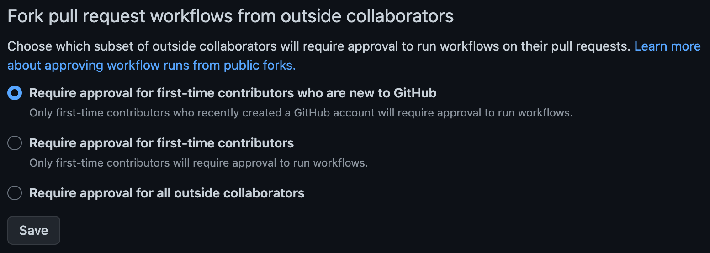

---
tags:
  - hostile-architecture
  - github
---

# Unfriendly CI

## Require approval before running CI

If the main CI/CD pipelines are waiting for pre-approval before running, it is a
sign that the CI/CD implementation is unfriendly towards new contributors.

With GitHub Actions being free for public repositories, there is no real reason
to avoid running at least some basic checks on every incoming pull request,
without waiting for a human to approve it.

Many project maintainers were worried about possibly incurring costs or leaks of
secrets caused by malicious contributors. The reality is that you should never
configure secrets as [repository secrets][1] and instead use [environments][2]
to store secrets. Environments are activated by using `environment: env-name` in
your workflow definitions and they can also be configured to require human
approval before running. They are implemented in such a way that an incoming
pull request from an outside contributor cannot make use of them, even if they
propose a change to the workflow definition.

To avoid the problem, be sure that you select the first option for requiring
approval, only for GitHub users that are new. The other two options deter new
contributors.

[1]:
  https://docs.github.com/en/codespaces/managing-codespaces-for-your-organization/managing-encrypted-secrets-for-your-repository-and-organization-for-github-codespaces
[2]:
  https://docs.github.com/en/actions/deployment/targeting-different-environments/using-environments-for-deployment
